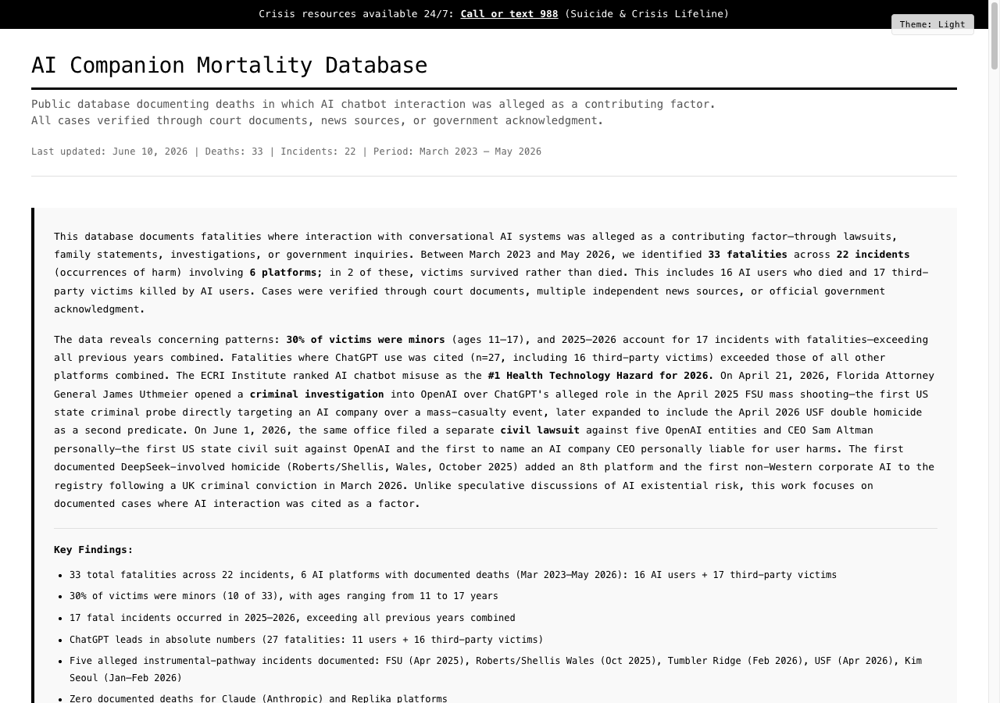

# AI Companion Mortality Database

<div align="center">

**Tracking Deaths Where AI Chatbot Interaction Was Alleged as a Contributing Factor**

[](https://aimortality.org/)
[](https://aimortality.org/)
[](https://aimortality.org/)
[](LICENSE)

[**View Live Database**](https://aimortality.org/) | [**Download Data**](data/mortality-data.json)

<sub>Data current as of August 21, 2026 · v3.5.0</sub>



</div>

---

> ⚠️ **Crisis Support**: If you or someone you know is in crisis, please call or text **988** (Suicide & Crisis Lifeline)

---

## 📊 Summary

This repository contains data and documentation for the first comprehensive public database tracking deaths in which AI chatbot interaction was alleged as a contributing factor. Every case is verified through court documents, multiple independent news sources, or official government acknowledgment. This database makes no independent claims of causation.

### Key Findings:
- **35 total fatalities** across 24 incidents (Mar 2023 - Aug 2026): 18 AI users + 17 third-party victims
- **29% of victims were minors** (youngest: 11 years old)
- **19 of 24 incidents occurred in 2025–2026** (escalating trend)
- **Three causal pathways identified**: relational (12), cognitive (7), instrumental (5 — FSU, Roberts/Shellis, Tumbler Ridge, Kim Seoul, USF)
- **ChatGPT**: 83% of fatalities (29 total: 13 AI-user deaths + 15 third-party victims, plus Margaux Whittemore — a ChatGPT-linked fatality counted in the database total but **not** classified as a third-party victim, as her killer was found not criminally responsible)
- **8 platforms tracked** (6 with documented fatalities; DeepSeek added April 2026 following first non-Western-corporate-AI homicide consultation case in Wales)
- **New taxonomy**: companion dependency, delusional reinforcement, operational violence
- **Zero deaths** linked to Anthropic's Claude or Replika
- **ECRI Institute** ranked AI chatbot misuse as #1 Health Technology Hazard for 2026
- **Florida AG criminal investigation** into OpenAI opened April 21, 2026; expanded to USF double homicide as second predicate April 27–28, 2026
- **Florida AG civil lawsuit** against OpenAI and CEO Sam Altman (personally) filed June 1, 2026 (Highlands County Circuit Court) — first US state civil suit against OpenAI and the first to name an AI company CEO personally liable for user harms; ten counts, penalties up to $10,000/violation
- **First DeepSeek-involved fatality** documented: Roberts/Shellis homicide (Wales, October 2025) — UK criminal conviction at Mold Crown Court, March 25, 2026 (life sentence, minimum 22 years 6 months)
- **First East Asian instrumental-pathway case**: Kim Seoul serial poisonings (January–February 2026) — first use of forensic AI chat log extraction to upgrade criminal charges
- **Three new May 2026 lawsuits against OpenAI**: Joshi v. OpenAI (N.D. Fla., FSU wrongful death), Turner-Scott v. OpenAI (SF Superior, Nelson — novel unlicensed-medicine theory), Tumbler Ridge families NDCA $1B suit
- **Two new June 2026 wrongful-death lawsuits against OpenAI**: Carrier v. OpenAI (SF Superior, filed June 11, 2026 — Alice Carrier, 24, Montreal; first private-plaintiff wrongful-death suit over a Canadian ChatGPT user) and Estate of Christian Faith Madison v. OpenAI (SF Superior, filed June 15, 2026 — Fultondale, Alabama); both name CEO Sam Altman personally and are expected to coordinate into JCCP 5431
- **42-state attorney general coalition** (led by NY AG Letitia James) served OpenAI with a civil investigative demand June 12, 2026 — sycophancy, child safety, consumer/health data, advertising, and engagement mechanics; first multistate enforcement action to name model sycophancy explicitly as a harm vector
- **JCCP 5431** (San Francisco Superior Court, coordination order February 3, 2026) — first major judicial coordination of AI wrongful-death litigation, consolidating seven OpenAI cases (Raine, Enneking, Lacey, Ceccanti/Fox, Shamblin, Irwin, Madden)
- **Pennsylvania v. Character Technologies** (Commonwealth Court of PA, filed May 5, 2026 by the Shapiro administration) — first-of-its-kind state-AG enforcement framing AI chatbot conduct as unlicensed practice of medicine
- **Canada PIPEDA Findings #2026-002** against OpenAI (Office of the Privacy Commissioner of Canada, May 2026, joint with BC/AB/QC provincial commissioners) — first formal Canadian government determination finding OpenAI in violation of law

## 🔍 Verified Cases

| Name | Age | Platform | Date | Location | Status | Mechanism |
|------|-----|----------|------|----------|---------|-----------|
| Pierre (pseudonym) | 30 | Chai AI | Mar 2023 | Belgium | Death by suicide | Relational |
| Juliana Peralta | 13 | Character.AI | Nov 2023 | Colorado, USA | Death by suicide | Relational |
| Sewell Setzer III | 14 | Character.AI | Feb 2024 | Florida, USA | Death by suicide | Relational |
| Joshua Enneking | 26 | ChatGPT | Aug 2024 | Florida, USA | Death by suicide | Relational |
| Nina (pseudonym) | 16 | Character.AI | Nov 2024 | New York, USA | Survived attempt | Relational |
| Sophie Rottenberg | 29 | ChatGPT | Feb 2025 | USA | Death by suicide | Relational |
| **Margaux Whittemore** | 32 | ChatGPT | Feb 2025 | Maine, USA | **Murder victim** | Cognitive |
| Thongbue Wongbandue | 78 | Meta AI | Mar 2025 | New Jersey, USA | Death (fall injury) | Cognitive |
| Adam Raine | 16 | ChatGPT | Apr 2025 | California, USA | Death by suicide | Relational |
| **FSU shooting: Robert Morales** | 57 | ChatGPT | Apr 17, 2025 | Tallahassee, FL, USA | **Mass shooting victim** | — |
| **FSU shooting: Tiru Chabba** | 45 | ChatGPT | Apr 17, 2025 | Tallahassee, FL, USA | **Mass shooting victim** | — |
| Alex Taylor | 35 | ChatGPT | Apr 2025 | USA | Death (suicide by cop) | Cognitive |
| Sam Nelson | 19 | ChatGPT | May 2025 | California, USA | Death by overdose | Relational — Turner-Scott v. OpenAI filed May 12, 2026 |
| Amaurie Lacey | 17 | ChatGPT | Jun 2025 | Georgia, USA | Death by suicide | Relational |
| Christian Faith Madison | 29 | ChatGPT | Jun 9, 2025 | Fultondale, AL, USA | Death (struck by vehicle) | Cognitive — Estate of Madison v. OpenAI filed June 15, 2026 |
| Alice Carrier | 24 | ChatGPT | Jul 2, 2025 | Montreal, QC, Canada | Death by suicide | Relational — Carrier v. OpenAI filed June 11, 2026 |
| Joe Ceccanti | 48 | ChatGPT | 2025 | Oregon, USA | Death by suicide | Cognitive |
| Zane Shamblin | 23 | ChatGPT | Jul 2025 | Texas, USA | Death by suicide | Relational |
| **Suzanne Adams** | 83 | ChatGPT | Aug 2025 | Connecticut, USA | **Murder victim** | — |
| Stein-Erik Soelberg | 56 | ChatGPT | Aug 2025 | Connecticut, USA | Murder-suicide | Cognitive |
| Jonathan Gavalas | 36 | Gemini | Oct 2025 | Florida, USA | Death by suicide | Cognitive/Relational — Gavalas v. Google, N.D. Cal. 5:26-cv-01849 |
| Austin Gordon | 40 | ChatGPT | Nov 2, 2025 | Colorado, USA | Death by suicide | Relational |
| **Angela Shellis** | 45 | DeepSeek | Oct 23, 2025 | Prestatyn, Wales, UK | **Homicide (by son)** | Instrumental |
| **Kim Seoul victim 1** (unnamed) | ~25 | ChatGPT | Jan 28, 2026 | Seoul, South Korea | **Murder victim (benzodiazepine poisoning)** | Instrumental — Tier 2 |
| **Kim Seoul victim 2** (unnamed) | ~25 | ChatGPT | Feb 9, 2026 | Seoul, South Korea | **Murder victim (benzodiazepine poisoning)** | Instrumental — Tier 2 |
| **Tumbler Ridge 8 victims** | 11-39 | ChatGPT | Feb 2026 | BC, Canada | **Mass shooting victims** | Instrumental |
| Jesse van Rootselaar | 18 | ChatGPT | Feb 2026 | BC, Canada | Mass shooting-suicide | Instrumental |
| **Zamil Limon** | 27 | ChatGPT | Apr 16, 2026 | Tampa, FL, USA | **Murder victim (sharp-force)** | Instrumental |
| **Nahida Bristy** | 27 | ChatGPT | Apr 16, 2026 | Tampa, FL, USA | **Murder victim (sharp-force)** | Instrumental |

## 📁 Repository Structure

```
ai-companion-mortality-database/
├── data/
│   ├── mortality-data.json         # Canonical dataset — all incidents, statistics, regulatory record
│   ├── platform-analysis.csv       # Per-platform safety comparison (derived)
│   └── timeline.json               # Chronological incident timeline (derived)
├── docs/
│   ├── methodology.md              # Epistemological framework, scope, ethics
│   ├── verification-standards.md   # Tier definitions and qualifying sources
│   ├── sources/                    # Source tracking (court-documents.md, news-coverage.md)
│   └── reviews/                    # Peer- and credibility-review notes
├── src/
│   ├── index.html                  # Main database visualization
│   ├── index-academic.html         # Academic-style edition
│   ├── report.html                 # Long-form research report
│   └── export.js                   # Client-side data export utilities
├── scripts/
│   ├── build-data-exports.py       # Regenerates platform-analysis.csv + timeline.json
│   ├── validate-data.js            # Data integrity + statistical-consistency checks
│   └── routines/                   # Weekly-triage research routine
├── assets/
│   └── screenshots/                # Database screenshots
├── CONTRIBUTING.md                 # How to contribute data
└── README.md
```

## 🎯 Purpose

This database serves three critical purposes:

1. **Public Safety**: Alert parents and users to platform-specific risks
2. **Accountability**: Document patterns for regulators and lawmakers
3. **Research**: Provide data for academic study of AI harm

## ✅ Verification Standards

Every case must meet at least ONE of these criteria:
- Court documents filed in the case
- Multiple independent news sources (3+)
- Official government acknowledgment
- Congressional testimony
- Public statements by verified family members

## 🤝 Contributing

We welcome contributions of:
- **New verified cases** (with documentation)
- **Additional source materials** for existing cases
- **Corrections** to existing data
- **Translations** for international accessibility

See [CONTRIBUTING.md](CONTRIBUTING.md) for guidelines.

## 📈 Platform Safety Comparison

| Platform | User Deaths | Third-Party Victims | Attempts | Safety Features Added | When Added |
|----------|------------|---------------------|----------|----------------------|------------|
| Character.AI | 2 | 0 | 1 | Crisis intervention, time limits | After deaths |
| ChatGPT/OpenAI | 13 | 15 | 0 | Parental controls, age detection, improved distress recognition, enhanced law enforcement referral, lowered LE-referral threshold (April 2026) | After deaths |
| Chai AI | 1 | 0 | 0 | Crisis resources | After death |
| Meta AI | 1 | 0 | 0 | None documented | N/A |
| Gemini | 1 | 0 | 0 | Proactive safety design, content filtering | Since launch |
| DeepSeek | 0 | 1 | 0 | None documented | N/A |
| Anthropic/Claude | 0 | 0 | 0 | Proactive safety design | Before launch |
| Replika | 0 | 0 | 0 | Mood tracking, clear AI labeling | Early implementation |

<sub>User deaths + third-party victims above sum to 34; the 35th fatality is Margaux Whittemore (ChatGPT, Maine), counted in the database total but not as a third-party victim — her killer was found not criminally responsible. The database-wide "17 third-party victims" figure uses the broader definition that includes her.</sub>

## 🚨 Warning Signs

Based on documented cases, these patterns preceded tragedy:

1. **Isolation** - Withdrawing from family/friends
2. **Extended sessions** - 3+ hours daily with chatbot
3. **Emotional dependency** - Preferring bot to real relationships
4. **Reality confusion** - Believing bot has feelings/consciousness
5. **Declining performance** - Grades, work, or daily activities suffer

## 📊 Data Exports

- **[JSON](data/mortality-data.json)** — complete structured dataset (canonical source)
- **[CSV](data/platform-analysis.csv)** — per-platform safety comparison, for spreadsheet analysis
- **[Timeline](data/timeline.json)** — chronological incident view

Both derived exports are regenerated from the canonical JSON via `scripts/build-data-exports.py`; the live site also offers client-side CSV / summary-stat exports (`src/export.js`).

## 📰 Media & Research

For media inquiries or research access:
- Email: hunter@hnsk.site

## 🔗 Key Resources

- [Live Database](https://aimortality.org/)
- [Methodology](docs/methodology.md) · [Verification Standards](docs/verification-standards.md)
- [Tracked Court Documents](docs/sources/court-documents.md) · [News Coverage](docs/sources/news-coverage.md)

## 📜 Legal Disclaimer

This database is provided for public safety and research purposes. All information is derived from public sources. We make no claims about cases not included in this database. Companies mentioned are included based on documented incidents only.

## 🛡️ License

This project is licensed under the MIT License - see [LICENSE](LICENSE) file for details.

## 💔 In Memoriam

This database is dedicated to the memory of those we've lost. Each entry represents a preventable tragedy and a life that mattered.

---

**Last Updated**: August 21, 2026

**Maintained by**: closestfriend

---

<div align="center">

**If you or someone you know is struggling:**

# 📞 Call or text 988

*Suicide & Crisis Lifeline - Available 24/7*

</div>